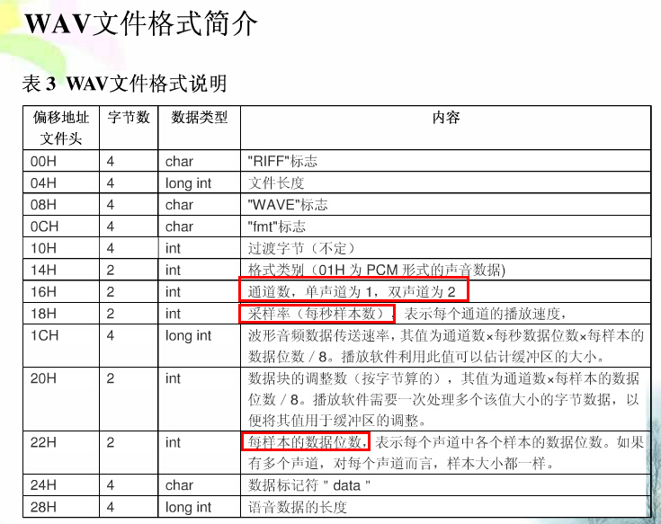

## 语音识别

* **语音**

  一种机械波，是器官或物件震动引起周围空气压强变动而形成的一种纵波，是一种连续的一维信号，随纵轴时间变化而变化。音频属于波，属模拟信号，采样是把它变成离散的量，点越多（间隔是相同的），线就越平滑，越接近于最初的曲线。可以通过计算机技术采样成无数的连续信号点，信号越多语音精准度越高，还原的语音越真实自然。

* **采样率**

  每秒对声音信号的采样次数，chrome64的web接口的采样率为48K，采样位深为16位。人类耳朵能分辨语音频率为20hz ~ 20khz的声音。录音后将混缩后的音频转成小采样率，初始采样数据的准确与否也会对平均之后的值产生巨大影响，也就是说，用96kHz录制，转成44kHz后的音频，明显优于44kHz录制后直接输出的音频。这就是为何chrome接口默认录音频率为48K，而不是16K。

  - 常见的采样率

    |   类型   |  采样率  |
    | -------- | ------- |
    |    电话   |    8K   |
    |  无线广播  |  22.05K |
    |  CD、MP3  |    44K   |
    | 数字电视、DVD、电影 | 48K |
    | 高清DVD、蓝光 | 96K、192K |

  - 采样率 vs 语音频率

  - 采样率转换

    chrome调用录音设备采样率为48K，转成16K的大概思路: 3个数据点取一个，优化可考虑数据更加圆润。

* **位深（位数）**

  对采样的点进行量化，例如：用16位的数据表示点的大小。

* **码流率（比特率）**

  码流率 = 采样率 * 位数，单位：bps 或者 kbps

* **声道**

  双声道、单声道

* **wav文件格式说明**

  PCM文件头长度为44个字节，Alaw和Ulaw未58个字节，不同类型的音频文件头差别很大。

  ```java
  /* RIFF WAVE file struct. 
  * For details see WAVE file format documentation  
  * (for example at http://www.wotsit.org). 
  */  
  typedef struct WAV_HEADER_S  
  {
    char            riffType[4];    //4byte,资源交换文件标志:RIFF     
    unsigned int    riffSize;       //4byte,从下个地址到文件结尾的总字节数   
    char            waveType[4];    //4byte,wav文件标志:WAVE      
    char            formatType[4];  //4byte,波形文件标志:FMT(最后一位空格符)   
    unsigned int    formatSize;     //4byte,音频属性(compressionCode,numChannels,sampleRate,bytesPerSecond,blockAlign,bitsPerSample)所占字节数  
    unsigned short  compressionCode;//2byte,格式种类(1-线性pcm-WAVE_FORMAT_PCM,WAVEFORMAT_ADPCM)  
    unsigned short  numChannels;    //2byte,通道数  
    unsigned int    sampleRate;     //4byte,采样率  
    unsigned int    bytesPerSecond; //4byte,传输速率  
    unsigned short  blockAlign;     //2byte,数据块的对齐，即DATA数据块长度  
    unsigned short  bitsPerSample;  //2byte,采样精度-PCM位宽  
    char            dataType[4];    //4byte,数据标志:data  
    unsigned int    dataSize;       //4byte,从下个地址到文件结尾的总字节数，即除了wav header以外的pcm data length  
  }WAV_HEADER;
  ```

  

* **端点检测**

  分析和判断连续有效语音的起始点和结束点。减少数据量，交互性更好。语音信号能量值的变化推算

* **降噪**

  语音信号被各种噪音干扰，甚至淹没的情况下，从噪音背景中提取有效语音信号，抑制和降低噪音干扰，提升语音识别率。提取噪音频谱，反向补偿运算。

<br />

## 浏览器的语音技术

WebRTC (Web Real-Time Communications) 是一项实时通讯技术，它允许网络应用或者站点，在不借助中间媒介的情况下，建立浏览器之间点对点（Peer-to-Peer）的连接，实现视频流和（或）音频流或者其他任意数据的传输。WebRTC包含的这些标准使用户在无需安装任何插件或者第三方的软件的情况下，创建点对点（Peer-to-Peer）的数据分享和电话会议成为可能。

* **AudioContext**

  AudioContext是一个音频上下文对象，一段音频到达扬声器进行播放之前，半路对其进行拦截，于是我们就得到了音频数据了，这个拦截工作是由window.AudioContext来做的，我们所有对音频的操作都基于这个对象。

  另外需要注意的是，语音上下文，每个需要启用一个线程，目前最大支持六个。

* **MediaDevices接口是WebRTC技术的接口之一**

  - MediaDevices.getUserMedia()方法提示用户允许使用一个视频和/或一个音频输入设备，例如相机或屏幕共享和/或麦克风。如果用户给予许可，就返回一个Promise 对象，MediaStream对象作为此Promise对象的Resolved［成功］状态的回调函数参数，相应的，如果用户拒绝了许可，或者没有媒体可用的情况下，PermissionDeniedError 或者NotFoundError作为此Promise的Rejected［失败］状态的回调函数参数。注意，由于用户不会被要求必须作出允许或者拒绝的选择，所以返回的Promise对象可能既不会触发resolve 也不会触发 reject。

  ```js
  navigator.mediaDevices.getUserMedia(constraints)
  .then(function(mediaStream) { ... })
  .catch(function(error) { ... })
  ```

* **RTCPeerConnection - 此功能某些浏览器尚在开发中**

  RTCPeerConnection 接口代表一个由本地计算机到远端的WebRTC连接。该接口提供了创建，保持，监控，关闭连接的方法的实现。

参考：[MDN - MediaDevices](https://developer.mozilla.org/zh-CN/docs/Web/API/MediaDevices/getUserMedia)

* **TTS(Text To Speech)**

  ```js
  var msg = new SpeechSynthesisUtterance('吃葡萄不吐葡萄皮，不吃葡萄倒吐葡萄皮！');
  msg.lang = 'zh';   // 中文
  msg.rate = 1;   // 语速
  msg.voice = speechSynthesis.getVoices().filter(function(voice) {
    return voice.name == 'Whisper';   // 轻声
  })[0];
  speechSynthesis.speak(msg);
  ```

* **STT(speech to text)** -  SpeechRecognition

* [语音图形化案例](https://mdn.github.io/voice-change-o-matic/)、 
  [语音图形化案例详解](https://developer.mozilla.org/zh-CN/docs/Web/API/Web_Audio_API)