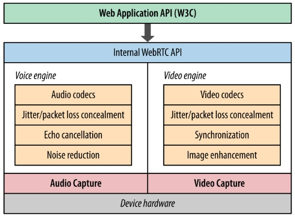
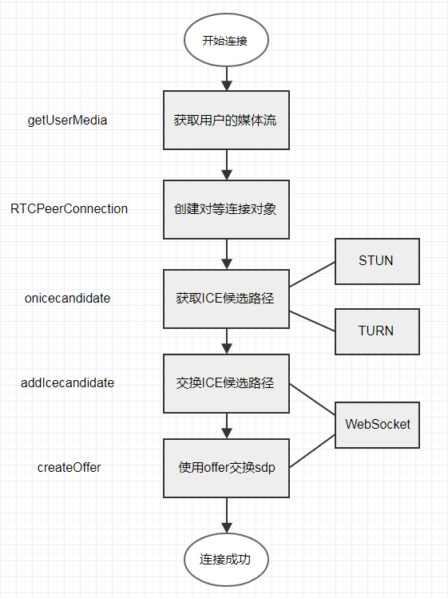

## webRTC

  Web browsers with Real-Time Communications (RTC). 2010年5月，Google 花费6820万美元收购拥有编解码、回声消除等技术的 GIPS 公司。之后谷歌开源了 GIPS 的技术，与相关机构 IETF 和 W3C 制定行业标准，组成了现有的 WebRTC 项目。相对应的是微软正试图推动万维网联盟(W3C)“可自定义的、无处不在的实时通信”(CU-RTC-Web)标准（微软的标准）。

  它并不是单一的协议， 包含了媒体、加密、传输层等在内的多个协议标准以及一套基于 JavaScript 的 API。通过简单易用的 JavaScript API ，在不安装任何插件的情况下，让浏览器拥有了 P2P音视频和数据分享的能力。

* **WebRTC 的核心组件**

  - 音视频引擎：OPUS、VP8 / VP9、H264
  - 传输层协议：底层传输协议为 UDP
  - 媒体协议：SRTP / SRTCP
  - 数据协议：DTLS / SCTP
  - P2P 内网穿透：STUN / TURN / ICE / Trickle ICE
  - 信令与 SDP 协商：HTTP / WebSocket / SIP、 Offer Answer 模型

  

* **主要JavaScript API**

  - MediaStream         音视频流对象
  - RTCPeerConnection   端对端音视频连接对象，用来建立和维护端到端连接，并提供高效的音视频流传输。
  - RTCDataChannel      端对端数据通道对象，用来支持端到端的任意二进制数据传输。

  
