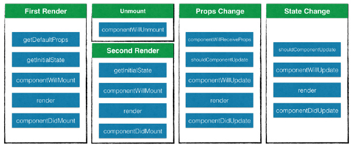

## React组件生命周期

  * 1、getDefaultProps  

  * 2、getInitialState  

  * 3、componentWillMount  

  * 4、componentWillReceiveProps

  * 5、shouldComponentUpdate

  * 6、componentWillUpdate

  * 7、render

  * 8、componentDidUpdate

  * 9、componentDidMount

  * 10、componentWillUnmount

  

  第一次页面加载时候组件的生命周期如下：  
  ```
    getDefaultProps -> getInitialState -> componentWillMount -> render ->componentDidMount
  ```

  如果时在Redux（后面会讲到）里加载组件，则生命周期如下：  
  ```
  getDefaultProps -> getInitialState -> componentWillMount -> render ->componentDidMount
  -> componentWillReceiveProps -> shouldComponentUpdate
  ```

  组件更新时的生命周期：  
  ```
  componentWillReceiverProps -> shouldComponentUpdate -> componentWillUpdate -> render
  -> componentDidUpdate

  如果shouldComponentUpdate返回false，则 componentWillUpdate -> render -> componentDidUpdate这三个方法不会被触发:
  componentWillReceiverProps -> shouldComponentUpdate
  ```

  

  * 1.父子组件之间通过属性来传递数据，属性可以是普通字符串也可以是回调函数  

  * 2.兄弟组件之间可以给每个组件设置一个ref属性，然后同样可通过属性来传递此ref数据
    但是建议不要这么做，这样结合过于紧密，正确的做法应该是通过消息来解决，Flux是facebook推的一种解决方案，实现这种方案的框架非常之多，
    Redux是Flux的一种实现，它让组件之间的交互，状态的维护变得简单
