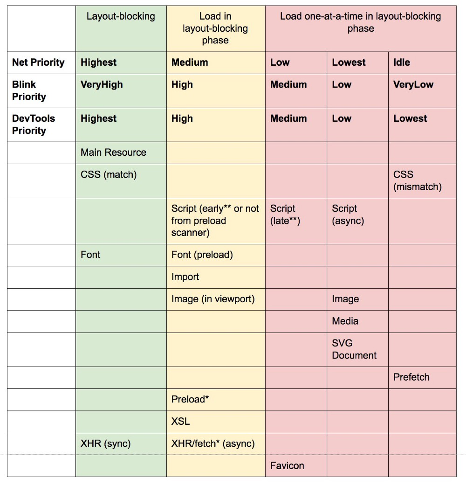

## preload vs prefetch

资源加载指令，preload, prefetch, preconnect。当一个资源被 preload 或者 prefetch 获取后，它可以从 HTTP 缓存移动至渲染器的内存缓存中。

`<link rel="preload" />` 和 `<link rel="prefetch" />`

```html
<link rel="preload" as="script" href="async_script.js"
onload="var script = document.createElement('script');
  script.src = this.href;
  document.body.appendChild(script);">
```

* preload

  Preload 是一个新的控制特定资源如何被加载的新的 Web 标准，这是已经在 2016 年 1 月废弃的 subresource prefetch 的升级版。这个指令可以在 `<link>` 中使用。preload 是声明式的 fetch，提高加载的优先级，强制浏览器优先请求资源，同时不阻塞文档 onload 事件。

  指定 as 属性来决定这个请求是否符合 content security policy。as属性值：`"script", "font", "style", "image", "media", "document"`。如果你的预加载需要 CORS 的跨域请求，那么也要加上 crossorigin 的属性。

  `<link rel="preload" href="late_discovered_thing.js" as="script">`
  `<meta http-equiv="Link" content="</images/big.jpeg>; rel=prefetch">`

  - http头和preload标签写法区别

    根据规范，许多服务器当它们遇到 preload HTTP 头会发起 HTTP/2 推送，不确保有没有发起不必要的推送，推荐使用标签写法，或者在http头加上nopush属性。

  - vs 浏览器预加载

  浏览器预加载只预先加载在HTML中声明的资源。preload 指令允许在 CSS 和JavaScript 中预加载指定的资源，并允许决定何时应用每个资源。

  - vs prefetch

  preload 专注于当前的页面，并以高优先级加载资源；Prefetch 专注于下一个页面将要加载的资源并以低优先级加载。

  ```js
  var preload = document.createElement("link");
  link.href = "myscript.js";
  link.rel = "preload";
  link.as = "script";
  document.head.appendChild(link);
  ```

  - 什么时候该用呢？当前页面很重要的需要优先加载的资源使用preload，例如：首屏渲染脚本，字体和图片等

  特别的地方，在 Chrome 中，如果用户从一个页面跳转到另一个页面，prefetch 发起的请求仍会进行不会中断。另外，prefetch 的资源在网络堆栈中至少缓存 5 分钟，无论它是不是可以缓存的。

* prefetch 

  Prefetch 是一个低优先级的资源提示，允许浏览器在后台（空闲时，由浏览器决定何时加载）获取将来可能用得到的资源，并且将他们存储在浏览器的缓存中。一旦一个页面加载完毕就会开始下载其他的资源，然后当用户点击了一个带有 prefetched 的连接，它将可以立刻从缓存中加载内容。有三种不同的 prefetch 的类型，link，DNS 和 prerendering。

  常用的地方，例如：用户输入出错的时候在输入框右边显示一个X的图片，如果等要显示的时候再去加载就会有延时，这个时候可以用一个link标签。

  `<link rel="prefetch" href="image.png">`

  - 预解析DNS，预建立TCP连接，查看chrome当前的dns解析缓存：`chrome://net-internals/#dns`

  `<link rel="dns-prefetch" href="//fonts.googleapis.com">`

  - 预渲染，提示可以用来预渲染将要导航到的下一个 HTML，不过要谨慎使用，避免带宽的资源浪费

  `<link rel="prerender" href="https://www.domain.com">`

  - 什么时候使用呢？用户不久即将需要加载的但优先级又不高的资源。

* preconnect

  允许浏览器在一个 HTTP 请求正式发给服务器前预先执行一些操作，包括 DNS 解析，TLS 协商，TCP 握手。使用 preconnect 是个有效而且克制的资源优化方法，它不仅可以优化页面并且可以防止资源利用的浪费。

  `<link href="https://cdn.domain.com" rel="preconnect" crossorigin>`




参考资料

[Link Preload 标签](http://eux.baidu.com/blog/fe/link-preload-%E6%A0%87%E7%AD%BE)
[preload vs prefetch优先级](https://juejin.im/post/58e8acf10ce46300585a7a42)
[什么是preload、prefetch](https://juejin.im/post/5b5984b851882561da216311)
