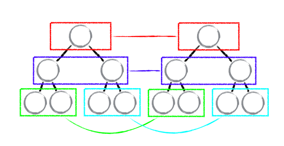
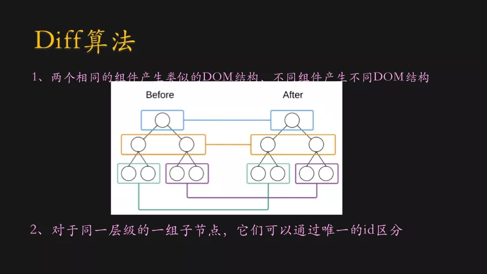

## react diff原理

根据新数据生成一个全新的Virtual DOM，然后跟上次生成的Virtual DOM去 diff，得到一个Patch，然后把这个Patch更新到浏览器的DOM上去，这里的patch是新的虚拟DOM和上一次的虚拟DOM经过diff后的差异化的部分。





* diff 策略

  - Web UI 中 DOM 节点跨层级的移动操作特别少，可以忽略不计。

  - 根节点的类型判断，不同则认为差别太大，旧组件卸载重新加载新组件

  - 拥有相同类的两个组件将会生成相似的树形结构，拥有不同类的两个组件将会生成不同的树形结构。

  - 对于同一层级的一组子节点，它们可以通过唯一 id 进行区分。

* tree diff

  对树进行分层比较，两棵树只会对同一层次的节点进行比较。而对于不同层级的节点，只有创建和删除操作。

* component diff

  - 如果是同一类型的组件，按照原策略继续比较 virtual DOM tree。

  - 如果不是，则将该组件判断为dirty component，从而替换整个组件下的所有子节点。

  - 对于同一类型的组件，有可能其Virtual DOM没有任何变化，如果能够确切的知道这点那可以节省大量的diff运算时间，因此React允许用户通过 shouldComponentUpdate()来判断该组件是否需要进行 diff。

* element diff

  - 同一层级的同组子节点，添加唯一 key 进行区分，在重新渲染过程中，如果key一样，若节点属性有所变化，则react只更新节点对应的属性；没有变化则不更新；如果key不一样，则react先销毁该节点，然后重新创建该节点。

  - key必须在其兄弟节点中是唯一的，而非全局唯一。万不得已，你可以传递他们在数组中的索引作为key。若元素没有重排，该方法效果不错，但重排会使得其变慢。


## pureRender优化

* shouldComponenetUpdate

  避免重复渲染，避免不必要的diff比较。像 React.PureComponent、react-pure-render 或 PureRenderMixin 中的浅比较。Immutable的深层比较优化。

  哪些情况是不必要的渲染？

  - 自身的state值并没有改变，只是调用了setState

  - 父组件的props引发的所有的子组件更新渲染

* PureComponent作用失效

  进行浅比较，非js基本类型失效，onClick回调使用箭头函数，每次回调匿名函数都会是不同对象，PureComponent作用失效。

* PureRenderMixin的核心代码

```js
function shallowCompare(instance, nextProps, nextState) {
  return (
    !shallowEqual(instance.props, nextProps) ||
    !shallowEqual(instance.state, nextState)
  );
}

function is(x, y) {
  // SameValue algorithm
  if (x === y) {
    // Steps 1-5, 7-10
    // Steps 6.b-6.e: +0 != -0
    return x !== 0 || 1 / x === 1 / y;
  } else {
    // Step 6.a: NaN == NaN
    return x !== x && y !== y;
  }
}

function shallowEqual(objA, objB) { // 浅比较
  if (is(objA, objB)) {
    return true;
  }

  if (typeof objA !== 'object' || objA === null || typeof objB !== 'object' || objB === null) {
    return false;
  }

  var keysA = Object.keys(objA);
  var keysB = Object.keys(objB);

  if (keysA.length !== keysB.length) {
    return false;
  }

  // Test for A's keys different from B.
  for (var i = 0; i < keysA.length; i++) {
    if (!hasOwnProperty.call(objB, keysA[i]) || !is(objA[keysA[i]], objB[keysA[i]])) {
      return false;
    }
  }

  return true;
}

module.exports = shallowEqual;
```

* Immutable

使用immutable，主要是因为其拥有如下特点：

  - 快，在深层对比对象（Map）或者数组（List）是否相同，比深层克隆式的比较快

  - 安全，指的是对所有immutable的增删改查，都是增量，不会使得原始数据丢失

immutable的缺点

  - immutablejs源文件较大

  - 具有很强的侵入性