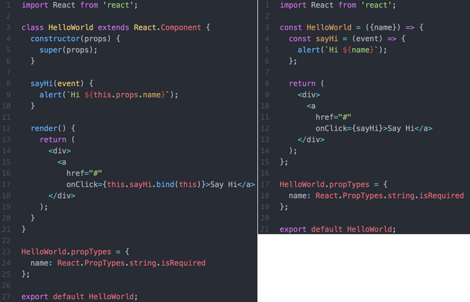

## React

  > 一个组件的渲染函数就是一个基于 state 和 props 的纯函数，state 是自己的，props 是外面来的，任何东西变了就重新渲染一遍.

* Element

  React.createElement(element, props[, children]),Element 是 createClass 的实例

* createClass

  React.createClass({ ... })  

  class MyComponent extends React.Component { ... }

* Component

  从 React 0.13 开始，可以使用 ES6 Class 代替 React.createClass, class HelloMessage extends React.Component { ... }

  - 区别

    + getInitialState() 取消，可以在构造函数中定义，如下：

      ```
      => ES 6

      getInitialState() {
        return {

        }
      }

      或者 => ES 7

      constructor(props) {
        super(props);
      }

      state = {}
      ```

    + 静态设置改变

      ```
      // 属性类型
      propTypes: {}

      => ES 6

      MyComponent.propTypes = {}

      或者 => ES 7

      static propTypes = {}
      ```

      ```
      // 获取属性默认值
      getDefaultProps: function(){ return {...} }

      => ES 6

      MyComponent.defaultProps = {}

      或者 => ES 7

      static defaultProps = {}

      ```

    + props格式验证

      ```
      => ES 6
      propTypes: {
        data: React.PropTypes.array.isRequired
      }

      => ES 7
      MyComponent.propTypes = {
        data: React.PropTypes.array.isRequired
      }
      ```

    + 绑定this作用域

      除了render方法都需要自己绑定指向当前Element的this对象, 以下几种方式：

        - =>箭头函数声明方式可以自动绑定(onClick={() => this.tick()})

        - 亦或者在构造函数中绑定(this.tick = this.tick.bind(this);)  -- 一次绑定随处可用

        - 亦或者在事件定义时绑定（onClick={this.click.bind(this)}）

    + 事件处理函数传参

      - `onClick={this.viewMore.bind(this, attributeId)}`

      - `onClick={(event)=>this.viewMore(attributeId, event)}`

      - `onClick={this.viewMore.bind(this)}  viewMore(event) {}`

      - `onClick={this.viewMore}  constructor() {this.viewMore=this.viewMore.bind(this);}`

* Factory

  简化了 React.createElement 的调用语法

  ```
  var div = React.createFactory('div');
  var root = div({ className: 'my-div' });

  // Factory函数原理
  function createFactory(type) {
    return React.createElement.bind(null, type);
  }
  ```

* 函数组件 vs 类组件

  
