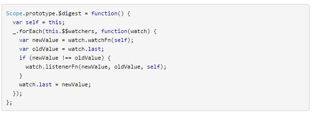

## vue vs angularjs vs react

* vue

  > 双向绑定的模板，精简的mvvm库

  - 特点

    + 库小，易于学习理解，拥有中文文档

  - 适用场景

  - 生态圈配套

* angularjs

  > 双向绑定，mvvc模式，脏检查，监听器

  - 适用场景

  - 特点

    + 大而全，学习曲线曲折

    + 脏检查

      

      当对象被绑定到html中后，这个对象才会添加为检查对象，同样当属性被绑定后，这个属性才会被列为检查的属性。系统的方法中都会触发比较事件，controller初始化，以ng-开头的事件触发，手动触发（$apply -> $digest）。$apply如果不给参数的话，会检查该$scope里的所有监听的属性，建议指定属性参数。

* react

  > 一个组件的渲染函数就是一个基于 state 和 props 的纯函数，state 是自己的，props 是外面来的，任何东西变了就重新渲染一遍.

  - 特点

    + 虚拟化DOM

    + 组件化

    + 单向数据流

  - 缺点

    + 架构：大型应用程序应该如何组织代码？

    + 通信：组件之间如何通信？

  - 适用场景

  - 生态圈配套（flux的实现）

    + redux

      函数式（Functional）管理，state 是不可变对象，适合大型项目

    + MobX

      响应式（Reactive）管理，state 是可变对象，适合中小型项目
