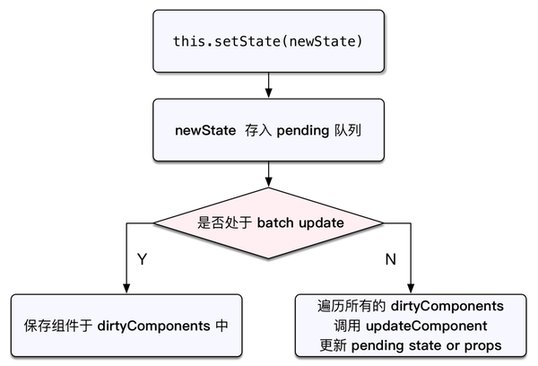

## setState

在React中，要改变组件的状态，不能直接用 `this.state = xxx` 这种方式来修改，如果这样做 React 就没办法知道你修改了组件的状态，也就没办法更新页面，只能使用setstate方法，而且setState不会立即更新组件。为了性能，React会延迟更新，会把多个组件的更新放在一次操作里。React中setState并不总是立即更新组件，它可能会推后至批量更新。

* setState是异步的吗？ 

setState本身并不是异步的，而是如果在调用setState时，如果react正处于更新过程，当前更新会被暂存，等上一次更新执行后在执行，这个过程给人一种异步的假象。

setState 只在合成事件和钩子函数中是“异步”的（非实时的），在原生事件和setTimeout 中都是同步的。

setState 的“异步”并不是说内部由异步代码实现，其实本身执行的过程和代码都是同步的，只是合成事件和钩子函数的调用顺序在更新之前，导致在合成事件和钩子函数中没法立马拿到更新后的值，形成了所谓的“异步”，当然可以通过第二个参数 setState(partialState, callback) 中的callback拿到更新后的结果。

* 分析原因

在 React 15 中， 执行生命周期函数或事件处理函数时会默认创建一个事务(transaction)，在其内部同步调用的 setState 都将被缓存入栈，待同步函数执行结束后开始批量更新（batch update），多个 setState 会被 merge 并得到终状态，之后真正的组件更新才会开始。值得一提的是，在事务之外执行的多个 setState 是不会被合并的，比如在 setTimeout 中调用的 setState。

在 React 16之后，React开发团队调整了渲染机制，新的调和算法fiber，将原有的同步渲染组件方式，改成可异步渲染且可中断渲染的机制。

* 调和过程（Reconciliation）

    - 1、将setState传入的partialState参数存储在当前组件实例的state暂存队列中。
    - 2、判断当前React是否处于批量更新状态，如果是，将当前组件加入待更新的组件队列中。
    - 3、如果未处于批量更新状态，将批量更新状态标识设置为true，用事务再次调用前一步方法，保证当前组件加入到了待更新组件队列中。
    - 4、调用事务的waper方法，遍历待更新组件队列依次执行更新。
    - 5、执行生命周期componentWillReceiveProps。
    - 6、将组件的state暂存队列中的state进行合并，获得最终要更新的state对象，并将队列置为空。
    - 7、执行生命周期componentShouldUpdate，根据返回值判断是否要继续更新。
    - 8、执行生命周期componentWillUpdate。
    - 9、执行真正的更新，render。
    - 10、执行生命周期componentDidUpdate。

* 代码实现

在 React 的 setState 函数实现中，会根据一个变量 isBatchingUpdates 判断是直接更新 this.state 还是放到队列(dirtyComponents)中回头再说；而 isBatchingUpdates 默认是 false，也就表示 setState 会同步更新 this.state。但是，有一个函数 batchedUpdates，这个函数会把 isBatchingUpdates 修改为 true，而当 React 在调用事件处理函数之前就会调用这个 batchedUpdates，造成的后果，就是由 React 控制的事件处理过程 setState 不会同步更新 this.state。也就是说，整个将 React 组件渲染到 DOM 中的过程就处于一个大的 transaction 中，有前置的 batchedUpdate 调用，isBatchingUpdates已经为true，生命周期函数或事件处理函数处于一个小的transaction中，也会受此影响而不进行立即更新。

那么调用this.setState()后什么时候this.state才会更新？答案是即将要执行下一次的render函数时。



```js
// Wrong
this.setState({
    counter: this.state.counter + this.props.increment,
});

// Correct
this.setState((prevState, props) => ({
    counter: prevState.counter + props.increment
}));

// 由React控制的事件处理过程setState不会同步更新this.state；在React控制之外的情况，setState会同步更新this.state，如：addEventListener，setTimeout/setInterval等, 这类情况下的setState没走react的事物机制transaction，执行时批量更新(isBatchingUpdates)没设置为true，因此每次都直接render了。

componentDidMount() {
    setTimeout(() => {
        this.setState({
        index: this.state.index + 1
      })
      console.log('state', this.state.index);   // 0
      this.setState({
        index: this.state.index + 1
      })
      console.log('state', this.state.index);   // 1
    }, 0)
}
```

* componentDidMount调用setstate

    官方文档的说明，不推荐直接在componentDidMount直接调用setState。

    原因：componentDidMount本身处于一次更新中，我们又调用了一次setState，就会在未来再进行一次render，造成不必要的性能浪费，大多数情况可以设置初始值来搞定。当然也有例外的情况必须在CDM中调用，比如：模态框和工具提示框，渲染后的尺寸和位置计算等。当state初始值依赖dom属性时，在componentDidMount中setState是无法避免的。

    *备注：componentWillUpdate componentDidUpdate中调用setState会造成死循环，导致程序崩溃。*

* 将props转换成自己的state

```js
class Child extends Component {
    constructor(props) {
        super(props);
        this.state = {
            someThings: props.someThings
        };
    }
    componentWillReceiveProps(nextProps) {
        this.setState({someThings: nextProps.someThings});
    }
    render() {
        return <div>{this.state.someThings}</div>
    }
}
```


