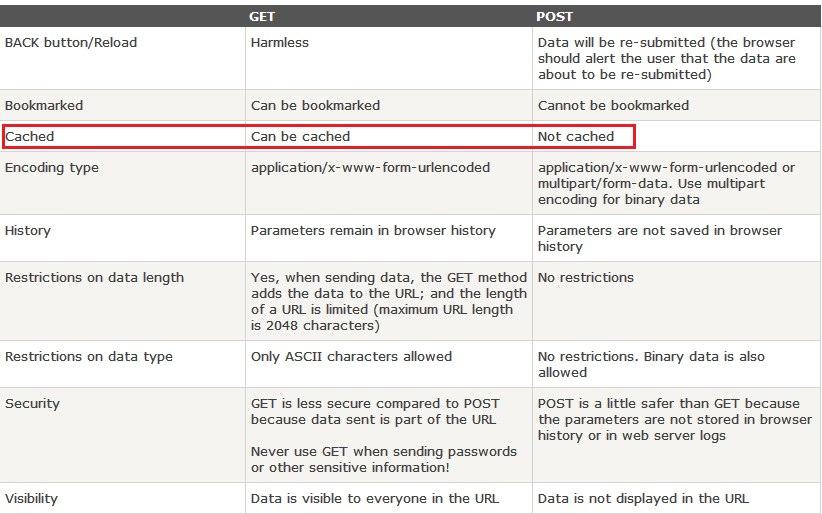

## 常见知识点

* contentType（表单提交，在form元素中修改enctype属性）

  默认值： "application/x-www-form-urlencoded", 表单键值对

  jQuery.ajax 中 contentType 设置为 false 是为了避免 JQuery 对其操作，从而失去分界符，而使服务器不能正常解析文件。

  "multipart/form-data", 可以上传文件，传二进制流等

  "text/plain", 表单数据中的空格转换为 "+" 加号，但不对特殊字符编码。

  "application/json", JSON方式请求

  - 指定response的数据类型，content-type

    XHR1可使用overrideMimeType方法，XHR2使用xhr.responseType属性，更加方便。

* timeout

  超过 timeout 设置时间请求还没有结束（包括成功/失败），则会触发ontimeout事件，主动结束该请求。计时起始点为xhr.send()方法的调用时刻，结束为xhr.loadend触发时刻。

  当xhr为一个sync同步请求时，xhr.timeout必须置为0，否则会抛错。

  常使用`Promise.race`模拟请求超时问题。

* async vs sync

  当xhr为同步请求时，有如下限制：

  - xhr.timeout必须为0

  - xhr.withCredentials必须为 false

  - xhr.responseType必须为""（注意置为"text"也不允许）

* send类型

  - ArrayBuffer

  - Blob

  - Document，如果data是 Document 类型，同时也是HTML Document类型，则content-type默认值为text/html; charset=UTF-8;否则为application/xml; charset=UTF-8。

  - DOMString，content-type默认值为text/plain; charset=UTF-8

  - FormData，content-type默认值为multipart/form-data; boundary=[xxx]

  - null

* withCredentials

  在发同域请求时，浏览器会将cookie自动加在request header中；但在发送跨域请求时，cookie并没有自动加在request header中。

  分析原因：在CORS标准中做了规定，默认情况下，浏览器在发送跨域请求时，不能发送任何认证信息（credentials）如"cookies"和"HTTP authentication schemes"。除非xhr.withCredentials为true（xhr对象有一个属性叫withCredentials，默认值为false）。

  所以根本原因是cookies也是一种认证信息，在跨域请求中，client端必须手动设置xhr.withCredentials=true，且server端也必须允许request能携带认证信息（即response header中包含Access-Control-Allow-Credentials:true），并且一定不能将Access-Control-Allow-Origin设置为*，而必须设置为请求页面的域名，这样浏览器才会自动将cookie加在request header中。

* xhr事件触发顺序

  正常情况下，事件的触发顺序如下：

  ```js
  xhr.onreadystatechange
  xhr.onloadstart
  xhr.onprogress
  xhr.onload
  xhr.onloadend
  ```

* ajax预检请求

  非简单请求是那种对服务器有特殊要求的请求，比如请求方法是PUT或DELETE，或者Content-Type字段的类型是application/json。非简单请求的CORS请求，会在正式通信之前，增加一次HTTP查询请求，称为"预检"请求（preflight）。  

  "预检"请求用的请求方法是OPTIONS，表示这个请求是用来询问的。头信息里面，关键字段是Origin，表示请求来自哪个源。

  - （1）Access-Control-Request-Method

    该字段是必须的，用来列出浏览器的CORS请求会用到哪些HTTP方法，上例是PUT。

  - （2）Access-Control-Request-Headers

    该字段是一个逗号分隔的字符串，指定浏览器CORS请求会额外发送的头信息字段，上例是X-Custom-Header。

  响应：服务器收到"预检"请求以后，检查了Origin、Access-Control-Request-Method和Access-Control-Request-Headers字段以后，确认允许跨源请求，就可以做出回应。

* response header

  W3C的 xhr 标准中做了限制，规定客户端无法获取 response 中的 Set-Cookie、Set-Cookie2这2个字段，无论是同域还是跨域请求。W3C 的 cors 标准对于跨域请求也做了限制，规定对于跨域请求，客户端允许获取的response header字段只限于“simple response header”和“Access-Control-Expose-Headers” 。

  getAllResponseHeaders()只能拿到限制内的header, getResponseHeader方法也只能传参为限制内的，否则报Refused to get unsafe header的错误。


## 有趣知识点

* js动态添加script的src地址：

  - html含有script元素，但没有src属性，js动态添加src地址，并且download对应的资源下来；

  - html含有script元素，并有src属性，js动态添加src地址不能download对应的资源；

  - js动态创建script元素，则可以多次download动态资源

  - iframe和img元素则可以多次添加src地址，并多次download资源

* Get vs Post

  - Post 比 Get安全一点点，Get会显示在浏览器地址和历史记录，并且会保存到web服务器日志里，但二者都是明文传送，因此被抓包的话，二者都不安全

  - Get更加方便手动输入使用

  - 可以重复的请求用Get(查), 不可重复的用Post(增删改)

  

## json

* 隐藏域缓存json字符串

  一般情况可以JSON.stringify方法进行缓存，但也会出现截断情况，建议使用encodeURIComponent方法编码字符串。

  `<input type="hidden" value="%7B%22name%22%3A%22John%22%7D">`


### Ajax的优缺点

- 优点：

  + 1、无需刷新页面就能更新数据,良好的用户体验；

  + 2、与传统模式相比，ajax按需发送，性能上更佳；

  + 3、减轻服务器和网络负担，将相当一部分工作转移到前端页面来处理。

- 缺点：

  + 1、部分浏览器不支持ajax，需要各种兼容来实现；

  + 2、破坏了浏览器本身自带的前进和后退功能；

  + 3、对搜索引擎支持不够，不利于爬虫工具的数据收集


