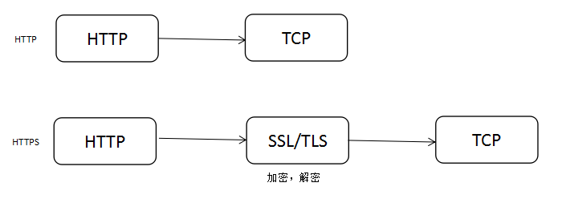

### http协议

> HTTP是一个客户端终端（用户）和服务器端（网站）请求和应答的标准（TCP）。http1.0默认为非持久连接，到http1.1版本协议，默认为持久连接。持久连接的特点就是，只要任意一端没有明确提出断开连接，则保持TCP连接状态。持久连接的好处在于，减少TCP连接的重复建立和断开造成的额外开销，减轻了服务器的负担，也让请求和响应更早地结束。

通常，由HTTP客户端发起一个请求，创建一个到服务器指定端口（默认是80端口）的TCP连接。HTTP服务器则在那个端口监听客户端的请求。一旦收到请求，服务器会向客户端返回一个状态，比如"HTTP/1.1 200 OK"，以及返回的内容，如请求的文件、错误消息、或者其它信息。

* HTTP/1.1协议中共定义了八种方法：options(预请求), head, get, put, delete, post, trace, connect.

* HTTP/1.1相较于HTTP/1.0协议的区别主要体现在：

  - 缓存处理
  - 带宽优化及网络连接的使用（持久化连接，同一域名下大部分浏览器支持六个持久连接）
  - 错误通知的管理
  - 消息在网络中的发送
  - 互联网地址的维护
  - 安全性及完整性

* HTTP状态码的第一个数字代表当前响应的类型：

  - 1xx消息——请求已被服务器接收，继续处理

    101：协议升级。主要用于websocket，也可以用于http2的升级。

  - 2xx成功——请求已成功被服务器接收、理解、并接受

  - 3xx重定向——需要后续操作才能完成这一请求，其中304状态码为重定向缓存。 

  - 4xx请求错误——请求含有词法错误或者无法被执行

  - 5xx服务器错误——服务器在处理某个正确请求时发生错误

* HTTP协议存在的瓶颈和局限

  - 一个连接只可发一个请求
  - 请求只可以客户端发起，不可以接受除响应以外的指令
  - 请求、响应未经过压缩就发送，首部信息越多延迟越大
  - 每次相互发送相同的首部信息，造成资源的浪费
  - 可任意选择数据压缩格式

* HTTP响应头

  - Expires response header里的过期时间，浏览器再次加载资源时，如果在这个过期时间内，则命中强缓存。它的值为一个绝对时间的GMT格式的时间字符串， 比如：`Expires:Thu,21 Jan 2018 23:39:02 GMT`。Expires 是http1.0的产物，所以Expires其实是过时的产物，现阶段它的存在只是一种兼容性的写法。

  - cache-control 这是一个相对时间，在配置缓存的时候，以秒为单位，用数值表示。当值设为max-age=300时，则代表在这个请求正确返回时间（浏览器也会记录下来）的5分钟内再次加载资源，就会命中强缓存。比如：`Cache-Control: max-age=300`。Cache-Control是http1.1的产物，优先级高于Expires。

    + public：所有内容都将被缓存（客户端和代理服务器都可缓存）。

    + private：所有内容只有客户端可以缓存，代理服务器不可以缓存，Cache-Control的默认取值。

    + no-cache: 强制向源服务器再次验证，响应中包含no-cache，那么缓存服务器则不能对资源进行缓存。需要注意的是，no-cache这个名字有一点误导。设置了no-cache之后，并不是说浏览器就不再缓存数据，只是浏览器在使用缓存数据时，需要先确认一下数据是否还跟服务器保持一致。

    + no-store：所有内容都不会被缓存，即不使用强制缓存，也不使用协商缓存

    + max-age: 响应的最大Age值（s）

  

  - Last-Modified和If-Modified-Since  当第一次请求资源时，服务器将资源传递给客户端时，会将资源最后更改的时间以“Last-Modified: GMT”的形式加在实体首部上一起返回给客户端。 客户端会为资源标记上该信息，下次再次请求时，会把该信息附带在请求报文中一并带给服务器去做检查，若传递的时间值与服务器上该资源最终修改时间是一致的，则说明该资源没有被修改过，直接返回304状态码，内容为空。

  - ETag和If-None-Match  Etag是上一次加载资源时，服务器返回的response header，是对该资源的一种唯一标识，只要资源有变化，Etag就会重新生成。浏览器在下一次加载资源向服务器发送请求时，会将上一次返回的Etag值放到request header里的If-None-Match里，服务器只需要比较客户端传来的If-None-Match跟自己服务器上该资源的ETag是否一致，就能很好地判断资源相对客户端而言是否被修改过了。

  - Access-Control-Allow-Origin：指定一个允许向该服务器提交请求的URI，所有域用星号表示

    `Access-Control-Allow-Origin: http://mozilla.com`

  - Access-Control-Expose-Headers：设置浏览器允许访问的服务器的头信息的白名单

    `Access-Control-Expose-Headers: X-My-Custom-Header, X-Another-Custom-Header`

  - Access-Control-Allow-Credentials: 告知客户端,当请求的credientials属性是true的时候,响应是否可以被得到

* **浏览器缓存**

  浏览器第一次向服务器发起该请求并拿到请求结果后，将请求结果和缓存标识存入浏览器缓存，浏览器对于缓存的处理是根据第一次请求资源时返回的响应头来确定的。另外，浏览器每次发起请求，都会先在浏览器缓存中查找该请求的结果以及缓存标识；浏览器每次拿到返回的请求结果都会将该结果和缓存标识存入浏览器缓存中。

  浏览器缓存分为：强制缓存和协商缓存，优先读取强制缓存。

  - 强缓存：不会向服务器发送请求，直接从缓存中读取资源，在chrome控制台的network选项中可以看到该请求返回200的状态码，并且size显示from disk cache或from memory cache；在浏览器中，浏览器会在js和图片等文件解析执行后直接存入内存缓存中；而css文件则会存入硬盘文件中，所以每次渲染页面都需要从硬盘读取缓存(from disk cache)。
    
  强制缓存分为：expires 和 cache-control，其中expires是一个特定的时间，是比较旧的标准；而cache-control是一个具体的时间长度，比较新的标准，优先级也比较高。

  - 协商缓存：向服务器发送请求，服务器会根据这个请求的request header的一些参数来判断是否命中协商缓存，如果命中，则返回304状态码并带上新的response header通知浏览器从缓存中读取资源；另外协商缓存需要与cache-control共同使用。

  协商缓存包括：etag 和 last-modified，last-modified的设置标准是资源的上次修改时间；而etag是为了应对资源修改时间可能很频繁的情况出现的，是基于资源的内容计算出来的值，因此优先级也较高，精度也要优于last-modified。

  - 协商缓存与强制缓存的区别在于，强制缓存不需要访问服务器，返回结果是状态码200；协商缓存需要访问服务器，如果命中缓存的话，返回结果是304。

  强制缓存优先于协商缓存进行，若强制缓存(Expires和Cache-Control)生效则直接使用缓存，若不生效则进行协商缓存(Last-Modified / If-Modified-Since和Etag / If-None-Match)，协商缓存由服务器决定是否使用缓存，若协商缓存失效，那么代表该请求的缓存失效，重新获取请求结果，再存入浏览器缓存中；生效则返回304，继续使用缓存。

  

  ```js
  // 字段优先级，越大越高
  cache-control > expires > etag > last-modified

  // 协商缓存
  last-modified: Wed, 16 May 2018 02:57:16 GMT
  if-modified-since: Wed, 16 May 2018 05:55:38 GMT

  if-none-match: "D5FC8B85A045FF720547BC36FC872550"
  etag: "D5FC8B85A045FF720547BC36FC872550"

  // 强制缓存
  expires: Thu, 16 May 2019 03:05:59 GMT
  
  cache-control: max-age=31536000
  ```

  备注：post(put)请求不能被缓存，设置了`Cache-Control:no-cache，pragma:no-cache，或Cache-Control:max-age=0`头信息的请求也不能被缓存。https请求可强制缓存。

  - 用户行为对浏览器缓存的影响

    + 地址栏访问，链接跳转是正常用户行为，将会触发浏览器缓存机制；

    + F5刷新，浏览器会设置max-age=0，跳过强缓存判断，会进行协商缓存判断；

    + ctrl+F5刷新，跳过强缓存和协商缓存，直接从服务器拉取资源。

### 其他解决方案

* 并行连接 同一域名下大部分浏览器支持六个持久连接，也就是多条TCP连接发起的并发http请求，缺点：竞争网络资源和服务器资源

* 持久化连接 重用TCP连接，以减少TCP连接及关闭时延，TCP连接默认不关闭，可以被多个请求复用，http/1.1已无需声明Connection: keep-alive

* 管道机制 http1.1版引入了管道机制（pipelining），即在同一个TCP连接里面，客户端可以同时发送多个请求，无需等待前面的请求回应。

  - Content-length字段的作用，声明本次回应的数据长度，用于区分数据包是属于哪一个回应的。

  - Transfer-Encoding: chunked，表明回应将由数量未定的数据块组成。每个非空的数据块之前，会有一个16进制的数值，表示这个块的长度。最后是一个大小为0的块，就表示本次回应的数据发送完了。

* [ajax - Asynchronous Javascript and XML](ajax) 通过XMLHttpRequest与服务端进行通信，对页面的局部内容进行更新。但ajax并没有解决http协议本身存在的瓶颈。

* comet 通过延迟应答响应，模拟向客户端推送消息的功能，实际上comet会将响应至于挂起状态，当服务端有内容更新，才返回该响应。维持连接会消耗更多的资源。

* spdy google 2009年，谷歌公开了自行研发的 SPDY 协议，主要解决 HTTP/1.1 效率不高的问题。SPDY并没有完全改写http协议，而是在应用层和传输层之间新加会话层的形式运作，并规定通信使用SSL。

  优势：

  - 多路复用
  - 请求优先级
  - 压缩http首部
  - 推送功能
  
  不足：

  - 多路复用只针对单个域名（IP地址）

* websocket web浏览器和web服务器之间全双工通信标准，协议由IETF制定，websocket api由W3C定位标准。一旦通信连接，可发送json, html, xml, 图片等任意格式的数据。

* http2 2015年，HTTP/2 发布，它不叫 HTTP/2.0，是因为标准委员会不打算再发布子版本了，下一个新版本将是 HTTP/3。http2的多项技术标准采用了spdy, http speed + mobility, network-friendly等协议标准。

* https vs http

  - HTTPS协议需要到CA申请证书，一般免费证书很少，需要交费。

  - HTTP协议运行在TCP之上，所有传输的内容都是明文，HTTPS运行在SSL/TLS之上，SSL/TLS运行在TCP之上，所有传输的内容都经过加密的。`http - ssl/tls - tcp`

  - HTTP和HTTPS使用的是完全不同的连接方式，用的端口也不一样，前者是80，后者是443。

  - HTTPS可以有效的防止运营商劫持，解决了防劫持的一个大问题。

  

* [Http2](./http2) 相比http1.1

    > HTTP/2 则是一个彻底的二进制协议，头信息和数据体都是二进制，并且统称为"帧"（frame）：头信息帧和数据帧。

    - 连接复用

    - 持久化连接

    - 强制加密

    - 服务端推送

    - 协议头压缩

* [Websocket](websocket)详解

  > Websocket借用了HTTP的协议来完成一部分握手，是一个持久化的协议，是相对于HTTP这种非持久(长连接，循环连接不算)的协议来说，更像是HTTP协议上的一种补充。Web Socket 是一种 HTML 5 为 Web 定制的全双工通讯协议，没有“请求 - 响应”的概念，浏览器与服务器完全平等，连接一旦建立就一直开放，双方可随时向对方发送任意数据，没有推拉之分。  

  ws最大的优势：在于服务器和客户端可以在给定的时间范围内的任意时刻，相互推送信息，数据的传输使用帧来传递，并且允许跨域通信。  

  目前主流的浏览器都支持WebSocket，并且有第三方的API：Guillermo Rauch创建了一个Socket.IO，遵循Engine.IO协议[Engine.IO protocol](https://github.com/socketio/engine.io-protocol)。

* SPDY协议特点 

    - 多路复用，一个TCP连接上同时跑多个HTTP请求，请求可设定优先级。
    
    - 去除不需要的HTTP头，压缩HTTP头，以减少需要的网络带宽。
    
    - 使用了SSL作为传输协议提供数据安全。
    
    - 对传输的数据使用gzip进行压缩
    
    - 提供服务方发起通信，并向客户端推送数据的机制。

  `http - spdy - ssl/tls - tcp`，SPDY位于HTTP之下，TCP和SSL之上，这样可以轻松兼容老版本的HTTP协议(将HTTP1.x的内容封装成一种新的frame格式)，同时可以使用已有的SSL功能。

* [Ajax - xhrHttpRequest](ajax)的总结

* 其他

    - [http状态码详解](http://tool.oschina.net/commons?type=5)