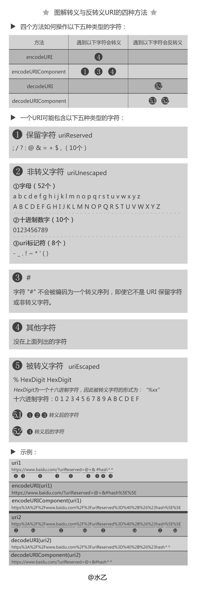

## Unicode vs GBK vs Utf-8

  > unicode，gbk和大五码就是编码的值，并且三者不兼容，而utf-8,uft-16之类就是这个值的表现形式.uft-8转换成GBK，必须先转成成Unicode，再转GBK。

## [ASCII、Unicode](http://www.ruanyifeng.com/blog/2007/10/ascii_unicode_and_utf-8.html)

  * ASCII
    八个二进制位就可以组合出256种状态，这被称为一个字节（byte）, 也就是一个字节都可以表示256个字符。上个世纪60年代，美国制定了一套字符编码，对英语字符与二进制位之间的关系，做了统一规定。这被称为 ASCII 码，一直沿用至今。

    ASCII 码一共规定了128个字符的编码，比如空格SPACE是32（二进制00100000），大写的字母A是65（二进制01000001）。这128个符号（包括32个不能打印出来的控制符号），只占用了一个字节的后面7位，最前面的一位统一规定为0。一个字节只能表示256种符号，肯定是不够的，就必须使用多个字节表达一个符号。比如，简体中文常见的编码方式是 GB2312，使用两个字节表示一个汉字，所以理论上最多可以表示 256 x 256 = 65536 个符号。

  * Unicode
    Unicode将世界上所有的符号都纳入其中，每一个符号都给予一个独一无二的编码，它是一个很大的集合，现在的规模可以容纳100多万个符号。比如，U+0639表示阿拉伯字母Ain，U+0041表示英语的大写字母A，U+4E25表示汉字严。具体的符号对应表，可以查询[unicode.org](http://www.unicode.org/)， 或者专门的[汉字对应表](http://www.chi2ko.com/tool/CJK.htm)。

  * 如何才能区别 Unicode 和 ASCII ？
    计算机怎么知道三个字节表示一个符号，而不是分别表示三个符号呢？

  * UTF-8
    UTF-8 就是在互联网上使用最广的一种 Unicode 的实现方式。其他实现方式还包括 UTF-16（字符用两个字节或四个字节表示）和 UTF-32（字符用四个字节表示），不过在互联网上基本不用。
    UTF-8 最大的一个特点，就是它是一种变长的编码方式。它可以使用1~4个字节表示一个符号，根据不同的符号而变化字节长度。

## escape vs encodeURI(unicode vs utf-8)

  * escape
  escape方法把字符串生成十六进制转义序列字符（特色字符如: @*_+-./ 被排除在外），当该值小于等于0xFF时,用一个2位转移序列: %xx 表示. 大于的话则使用4位序列:%uxxxx 表示。目前该方法以及废弃，推荐使用encodeURI。escape 的编码有一个弊端在于，它后面是4位16进制，故不支持基本多文种平面（BMP）外的字符（unicode大于0xffff）的字符；而encodeURI是基于 UTF-8的，编码本身理论上可以支持0x10ffff内的字符（实际上现在的JavaScript不支持BMP外的字符，所以encodeURI也不支持 ）。

  ```
  escape("äöü");        // "%E4%F6%FC"
  escape("ć");          // "%u0107"
  ```

  * encodeURI
  encodeURI方法主要针对URL地址， encodeURI方法不会对下列字符编码： ASCII字母、数字、~!@#$&*()=:/,;?+'，
  


  * encodeURIComponent
  encodeURIComponent方法不会对下列字符编码： ASCII字母、数字、~!*()'

  备注：escape 在处理0xff之外字符的时候，是直接使用字符的unicode在前面加上一个 「%u」，而encodeURI则是先进行UTF-8，再在UTF-8的每个字节码前加上一个「%」；在处理0xff以内字符时，编码方式是一样的（都是「%XX」，XX为字符的16进制unicode，同时也是字符的UTF-8），只是范围（即哪些字符编码哪些字符不编码）不一样。encodeURI 是W3C 的标准，而 escape 是非标准。

  | 字符 | UTF-8编码十进制 | UTF-8编码十六进制  | Unicode编码十进制  | Unicode编码十进制 |
  | ---- |  -----------  |  ---------   |  ---------  |  ---------  |
  |   ä    |    50084    |  	C3A4      |	    228	    |    E4    |
  |   ö    |	  50102    |  	C3B6      |	    246     |	   F6    |
  |   ü    |	  50108    |  	C3BC      |	    252     |	   FC    |
  |   ć    |	  50311    |  	C487      |	    263     |	   107   |


备注：（侵图必删）