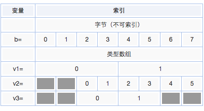

## XMLHttpRequest数据类型

- xhr1

  * DOMString，在JavaScript中，DOMString就是String，指的是UTF-16字符串，而JavaScript正是使用了这种编码的字符串。XHR的responseText就是字符串。

  * Document，Document对象，可以理解为XML数据类型，如responseXML

- xhr2

  * FormData，构造函数，可以传递HTMLFormElement参数（可选），表示要序列化的表单元素。formdata用键值对key-value方式模拟表单提交，并且可以一步上传二进制文件。可以使用append方法添加键值对。

    FormData提交格式的每个数据分三部分:

      + 分界线(boundary), 二进制大文件的分界线，chrome使用“——WebKitFormBoundary”加16位随机Base64位编码的字符串作为分隔边界

      + 内容配置信息

      

      + 传输内容

    ```
    var formdata = new FormData();
    formdata.append('key', 'value');
    // ...
    xhr.send(formdata);
    jQuery.ajax({
      url: '',
      data: formdata,
      processData: false, // 不处理数据，避免异常
      contentType: false  // 不设置内容类型，用默认的表单类型，会自动加上boundary
    })
    ```

    注意点：*jQuery.ajax时，加上processData: false, contentType: false,避免jQuery解析data发生异常*

  * Blob，BLOB (binary large object)，表示二进制大对象。

    > 一个Blob对象就是一个包含有只读原始数据的类文件对象。Blob对象中的数据并不一定得是JavaScript中的原生形式。File接口基于Blob, 继承了Blob的功能，并且扩展支持了用户计算机上的本地文件。创建Blob对象的方法有几种，可以调用Blob构造函数，还可以使用一个已有Blob对象上的slice()方法切出另一个Blob对象，还可以调用canvas对象上的toBlob方法。

    构造函数，可选两个参数：

      - parts 数组，包含了将要添加到Blob对象中的数据。数组元素可以是任意多个的ArrayBuffer, ArrayBufferView(typed array), Blob, 或者DOMString对象。

      - properties 一个对象，设置Blob对象的一些属性。目前仅支持一个type属性，表示Blob的类型。

    Blob对象有两个属性：

      - size Blob对象的数据大小，单位为字节，只读

      - type 字符串，表明Blob对象包含数据的MIME类型，例如："image/jpeg"

    Blob对象的方法slice，可以实现文件的分隔，传递三个参数 start：开始索引，end：结束索引，contentType：新的Blob对象的MIME类型。

    ```
    var xhr = new XMLHttpRequest();    
    xhr.open("get", "some.png", true);
    xhr.setRequestHeader('Content-Type','application/x-www-form-urlencoded; charset=GBK');
    xhr.responseType = "blob";
    xhr.onreadystatechange = function() {
        if (this.status == 200) {
            var blob = this.response;  // this.response也就是请求的返回就是Blob对象
            var img = document.createElement("img");
            img.onload = function(e) {
              window.URL.revokeObjectURL(img.src); // 清除释放
            };
            img.src = window.URL.createObjectURL(blob);
            eleAppend.appendChild(img);    
        }
    }
    xhr.send();
    ```

    注意点：*blob方式跟ajax同样存在跨域的问题*

  * File

    > 表示我们使用file控件(<input type="file">)选择的FileList对象，或者是使用拖拽操作搞出的DataTransfer对象。

    - name 文件对象的名称，File.name

    - size 该Blob对象所包含数据的字节大小，Blob.size

    - type 该Blob对象所包含数据的MIME类型，Blob.type

  * ArrayBuffer

    > ArrayBuffer表示二进制数据的原始缓冲区，该缓冲区用于存储各种类型化数组的数据，也就是二进制数据通用的固定长度容器。

    - vs Blob

      ArrayBuffer就是缓冲出来的打死不动的二进制对象，如 0101 1000 1101之类的，并且是不可以读写的二进制对象，需要借助类型化数组或DataView对象来解释原始缓冲区数据；

      Blob可以append ArrayBuffer的数据，可以列举为更加高级的二进制大对象。

      ```
      // 创建一个8字节的ArrayBuffer  
      var b = new ArrayBuffer(8);  

      // 创建一个指向b的视图v1，采用Int32类型，开始于默认的字节索引0，直到缓冲区的末尾  
      var v1 = new Int32Array(b);  

      // 创建一个指向b的视图v2，采用Uint8类型，开始于字节索引2，直到缓冲区的末尾  
      var v2 = new Uint8Array(b, 2);  

      // 创建一个指向b的视图v3，采用Int16类型，开始于字节索引2，长度为2  
      var v3 = new Int16Array(b, 2, 2);  
      ```
      

      命名都是：基本类型+位数+Array。我们都知道一个字节是8位的，所以8位的数组中每个元素就占一个字节。同理可知64位的数组每个元素占8个字节。就拿Int8Array来说，它是8位的整数。8位可以表示28=256个数字。而Int是有符号的，所以Int8Array的元素可以表示-128到127的整数。而Uint8Array的元素是无符号的，同理可知它可以表示0-255的整数。
　　   由于这些数组是使用线性储存，因此它们是定长的，无法给数组添加元素。超出索引的赋值不会报错，也不会生效。
