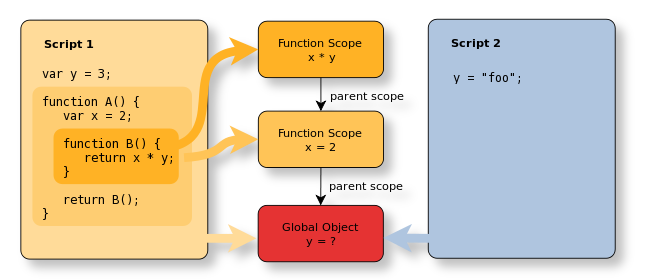

## 深入理解作用域

> 一段程序代码中所用到的变量或函数并不总是有效、可用的，而限定这个变量的可用性的代码范围就是作用域。Javascript中的作用域就是词法作用域（事实上大部分语言都是基于词法作用域的），但eval 和 with可以产生动态作用域的效果。

* 词法作用域

    又叫静态作用域，是指在词法分析阶段就确定了，不会改变。

* 动态作用域

    是在运行时根据程序的流程信息来动态确定的，而不是在写代码时进行静态确定的。动态作用域并不关心函数和作用域是如何声明以及在何处声明的，只关心它们从何处调用。换句话说，作用域链是基于调用栈的，而不是代码中的作用域嵌套。
    需要明确的是，Javascript并不具有动态作用域，它只有词法作用域，简单明了。但是，它的 eval()、with、this机制某种程度上很像动态作用域，使用上要特别注意。

* 主要区别

    词法作用域是在写代码或者定义时确定的，而动态作用域是在运行时确定的（this也是！）。词法作用域关注函数在何处声明，而动态作用域关注函数从何处调用。通俗说法，词法作用域的函数中遇到既不是形参也不是函数内部定义的局部变量的变量时，去函数定义时的环境中查询。动态域的函数中遇到既不是形参也不是函数内部定义的局部变量的变量时，到函数调用时的环境中查。

    词法作用域的函数中遇到既不是形参也不是函数内部定义的局部变量的变量时，去函数定义时的环境中查询。

    动态域的函数中遇到既不是形参也不是函数内部定义的局部变量的变量时，到函数调用时的环境中查。

    

* 避免滥用eval  

  eval函数会将其参数当做javascript程序进行解释，并运行于调用者的局部作用域，也就是赋予了外部调用者能改变函数内部作用域的能力。  
  尽量避免使用eval函数污染内部作用域，非用不可，尽量间接调用，再不行封装在即执行函数作用域内。  
  
  eval函数具有调用整个作用域的能力，即直接调用eval函数放在局部作用域内求值，而间接调用eval函数放在全局作用域内求值。  
  两种间接调用方式：eval赋值给变量；(0,eval)(parameters)  
  
  通常情况下，直接调用eval函数性能消耗较大，可能导致其包含的函数以及所有直到最外层的函数运行都相对缓慢。

## 案例分析

```
var x = 1;       
function a() {                
    console.log(x);          // 1, 函数a创建时就确定了scope，记录x为1
}      
!function() {             
    var x = 2;              
    a();       
} ();
```