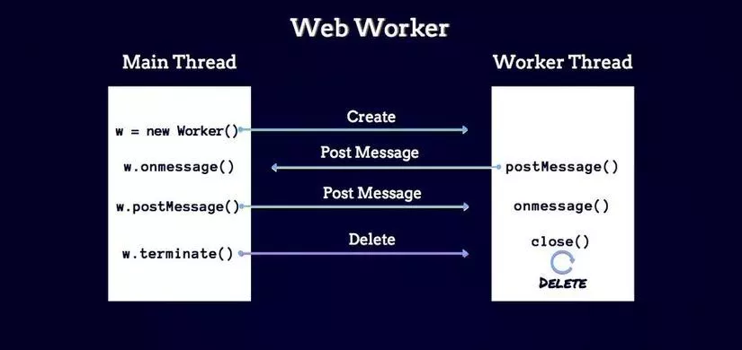
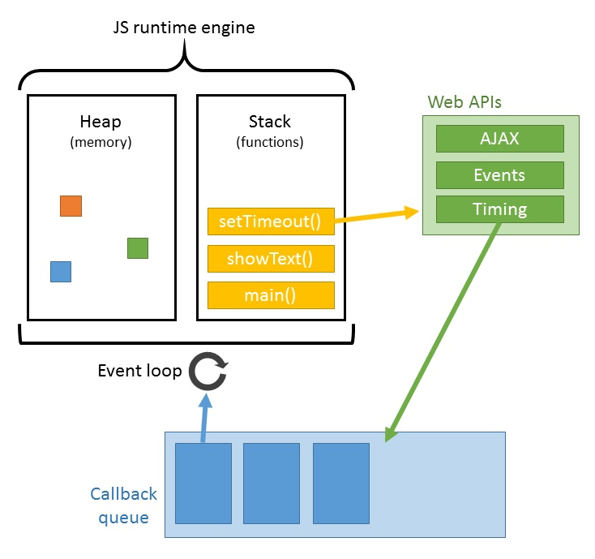
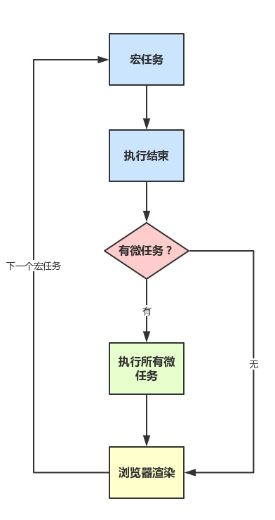

## 浏览器线程

  > 浏览器内核是多线程的，它们在内核控制下相互配合以保持同步，一个浏览器通常由以下常驻线程组成：GUI 渲染线程，javascript 引擎线程，浏览器事件触发线程，定时触发器线程，异步 http 请求线程。

  - js引擎线程 （解释执行js代码）Javascript 引擎线程理所当然是负责解析 Javascript 脚本，运行代码。一个浏览器进程无论什么时候都只有一个 JS 线程在运行 JS 程序。

    Javascript是单线程运行、支持异步机制的语言。JavaScript的主要用途是与用户互动，以及操作DOM，避免带来复杂的同步问题，因此JavaScript设计为单线程。js主线程模块(DOM，ajax, http)，js消息线程模块（event loop，异步任务通知，IO设备，定时事件）

    主线程运行的时候，产生堆（heap）和栈（stack），栈中的代码调用各种外部API，它们在"任务队列"中加入各种事件（click，load，done）。只要栈中的代码执行完毕，主线程就会去读取"任务队列"，依次执行那些事件所对应的回调函数。执行栈中的代码，总是在读取”任务队列”之前执行。

    JS引擎一直等待着任务队列中任务的到来，然后加以处理，一个Tab页（renderer进程）中无论什么时候都只有一个JS线程在运行JS程序。

  - GUI渲染线程   负责渲染浏览器界面，解析HTML，CSS，构建DOM树和RenderObject树，布局和绘制等。（绘制用户界面、与js主线程是互斥的），界面需要重绘或者回流时，该线程也会执行。当JS引擎执行时GUI线程会被挂起，GUI 更新会被保存在一个队列中等到 JS 引擎空闲时立即被执行。

    ```html
    <!-- 不阻碍DOM下载和解析，阻碍渲染，因为css加载是由单独的下载线程异步下载的 -->
    <link href="/css/test.css" />
    <script>
    function test(){
      console.log('something');
    }
    test();
    </script>
    <!-- async 阻塞页面解析和渲染，下载解析完脚本立即执行 -->
    <script src="/js/bar.js"></script>
    <!-- async 不阻塞页面解析和渲染，下载完立即执行，顺序难以保证 -->
    <script async src="/js/boo.js"></script>
    <!-- defer 不阻塞页面解析和渲染，下载后等DOM解析完才执行 -->
    <script defer src="/js/foot.js"></script>
    ```

  - http网络请求线程 （处理用户的get、post等请求，等返回结果后将回调函数推入任务队列）XMLHttpRequest是通过浏览器新开一个线程进行请求，并将检测状态变更，状态发送变更异步线程就产生状态变更事件，将这个回调函数放入事件队列中，再由JavaScript引擎执行。

  - 定时触发器线程 （setTimeout、setInterval等待时间结束后把执行函数推入任务队列中）。浏览器定时计数器并不是由 JavaScript 引擎计数的（因为JavaScript引擎是单线程的, 如果处于阻塞线程状态就会影响记计时的准确），由单独的定时触发器线程计时；并且setTimeout的等待时间结束后并不是直接执行的，而是先推入浏览器的一个任务队列，在同步队列结束后在依次调用任务队列中的任务。注意，W3C在HTML标准中规定，规定要求setTimeout中低于4ms的时间间隔算为4ms。

  - 浏览器事件触发线程   归属于浏览器而不是JS引擎，用来控制事件循环（可以理解秘书助理）。（将click、mouse等交互事件发生后将这些事件放入事件队列中）当一个事件被触发时该线程会把事件添加到待处理队列的队尾，等待 JS 引擎的处理。这些事件可以是当前执行的代码块，如：定时任务-setTimeout；也可来自浏览器内核的其他线程，如：鼠标点击、AJAX 异步请求等，但由于JS的单线程关系，所有这些事件都得排队等待 JS 引擎处理。

  

## webworker

  为了利用多核CPU的计算能力，HTML5提出Web Worker标准，允许JavaScript脚本创建多个线程，但完全受控于主线程。其实就是在Javascript单线程执行的基础上，开启一个子线程，进行任务处理，而不影响主线程的执行，子线程并不支持操作页面的DOM；当子线程执行完毕之后再回到主线程上，在这个过程中并不影响主线程的执行过程。

  Web Worker的基本原理就是在当前的主线程中加载一个只读文件来创建一个新的线程，两个线程同时存在，且互不阻塞，并且在子线程与主线程之间提供了数据交换的接口postMessage和onmessage，来进行发送数据和接收数据，其数据格式可以为结构化数据（JSON等）。

  

  * vs SharedWorker

  WebWorker只属于某个页面，不会和其他页面的Render进程（浏览器内核进程）共享，所以Chrome会创建一个新的线程来运行Worker中的JavaScript；SharedWorker是浏览器所有页面共享的，所以Chrome浏览器为SharedWorker单独创建一个进程来运行JavaScript。

  本质上就是进程和线程的区别，SharedWorker由独立的进程管理，WebWorker只是属于render进程下的一个线程。

### 定时器

当使用setTimeout或setInterval时，需要定时器线程计时，计时完成后就会将特定的事件推入事件队列中。那么为什么要单独的定时器线程？因为JavaScript引擎是单线程的, 如果处于阻塞线程状态就会影响记计时的准确，因此很有必要单独开一个线程用来计时。

* setTimeout会准时执行吗？

  ```js
  function testTimeout() {
    let startTime = performance.now() // 设置开始的时间戳
    setTimeout(function(){
      const passTime = performance.now() - startTime // 获取当前时间和开始时间差
      console.log('执行时间为：', passTime);  // 正常情况下在130毫秒左右
    }, 100);
    let i = 9999999;
    do {
      i--;
    } while (i)
  }
  ```

  定时器并不能保证真正定时执行，一般会延迟一些时间执行。调用 setTimeout 函数会在一个时间段过去后在队列中添加一个消息，这个时间段作为函数的第二个参数被传入。如果队列中没有其它消息，消息会被马上处理。但是，如果有其它消息，setTimeout 消息必须等待其它消息处理完。因此第二个参数仅仅表示最少的时间，而非确切的时间。

  也就是说，setTimeout()只是将事件插入了任务队列，必须等到当前代码（执行栈）执行完，主线程才会去执行它指定的回调函数。setTimeout 里面的代码是在当前环境中的任务执行完了「之后」才执行，实际上是js引擎调用的event loop模块，event loop有4ms的时间间隔，并不是真正意义上的同时进行。Ajax可以和js代码同时运行的，因为它是有浏览器的http网络请求线程负责，并不是js引擎。

* setInterval vs setTimeout模拟定时执行

  setTimeout计时到后就会去执行，然后执行setTimeout的回调处理函数需要一段时间，再才会继续下一个setTimeout，中间就多了运行回调函数代码的时间；setTimeout的定时可以理解为至少需要多少时间。

  而setInterval，定时线程会在每次到时候精准地将回调函数推入任务队列，中间没有运行代码的时间，存在上次未执完的可能性，会导致要么某次被跳过（浏览器本身优化，当前事件队列中有setInterval的回调，不会重复放入队列），要么间隔时间比预期小；而且把浏览器最小化显示等操作时，浏览器会把setInterval的回调函数放在队列中，等浏览器窗口再次打开时，一瞬间全部执行时。

  ```js
  // setTimeout vs setInterval
  setTimeout(function fn(){       
    // TODO
    setTimeout(fn, 100);
  }, 100);
  setInterval(function(){
    // TODO
  }, 100);
  ```

### 执行任务（执行栈）

  

  > 所有任务可以分成两种，一种是同步任务（synchronous），另一种是异步任务（asynchronous）。同步任务指的是，在主线程上排队执行的任务，只有前一个任务执行完毕，才能执行后一个任务；异步任务指的是，不进入主线程、而进入"任务队列"（task queue）的任务，只有"任务队列"通知主线程，某个异步任务可以执行了，该任务才会进入主线程执行。

  * 所有同步任务都在主线程上执行，形成一个 **执行栈**（execution context stack）。

  * 主线程之外还有个消息线程，消息线程存在任务队列，只要异步任务有了运行结果，就在"任务队列"之中放置一个事件。

  * 一旦"执行栈"中的所有同步任务执行完毕，系统就会读取"任务队列"，看看里面有哪些事件。那些对应的异步任务，于是结束等待状态，进入执行栈，开始执行。

  * 重复上一步

  ```js
  // 2 3 5 4 1
  setTimeout(function() {   // macrotask
    console.log(1);
  }, 0);
  new Promise(function executor(resolve) {
    console.log(2);
    for( var i=0 ; i<10000 ; i++ ) {
      i == 9999 && resolve();
    }
    console.log(3);
  }).then(function() {
    console.log(4);   // microtask
  });
  console.log(5);
  ```

  * 栈

  栈（stack）中主要存放一些基本类型（Undefined、Null、Boolean、Number 和 String）的变量和对象的引用（基本类型值在内存中占据固定大小的空间，因此被保存在栈内存中），其优势是存取速度比堆要快，并且栈内的数据可以共享，但缺点是存在栈中的数据大小与生存期必须是确定的，缺乏灵活性。

  栈中不存在对堆中某个对象的引用，那么就认为该对象已经不再需要，在垃圾回收时就会清除该对象占用的内存空间。因此，在不需要时应该将对对象的引用释放掉（解除引用），以利于垃圾回收，这样就可以提高程序的性能。释放对对象的引用最常用的方法就是为其赋值为null，这种做法适用于大多数全局变量和全局对象的属性。局部变量会在他们离开执行环境时自动被解除引用。解除一个值的引用并不意味着自动回收该值所占用的内存。解除引用的真正作用是让值脱离执行环境，以便垃圾收集器下次运行时将其回收。

  ```js
  // JS实现栈代码
  function Stack() {
    // 用数组来模拟栈
    var items = [];

    // 将元素送入栈，放置于数组的最后一位
    this.push = function(element) {
      items.push(element);
    };

    // 弹出栈顶元素
    this.pop = function() {
      return items.pop();
    };

    // 查看栈顶元素
    this.peek = function() {
      return items[items.length - 1];
    }

    // 确定栈是否为空 @return {Boolean} 若栈为空则返回true,不为空则返回false
    this.isAmpty = function() {
      return items.length === 0
    };

    // 清空栈中所有内容
    this.clear = function() {
      items = [];
    };

    // 返回栈的长度 @return {Number} 栈的长度
    this.size = function() {
      return items.length;
    };

    // 以字符串显示栈中所有内容
    this.print = function() {
      console.log(items.toString());
    };
  }
  ```

  * 堆

    堆（heap）用于复杂数据类型（引用类型）分配空间，例如数组对象、object对象（引用类型的值通常大小不固定，所以被存储在堆内存中）。它是运行时动态分配内存的，大小不定，也不会自动释放，存取速度较慢。指那些可能由多个值构成的对象，保存在堆内存中，包含引用类型的变量，实际上保存的不是变量本身，而是指向该对象的指针。

    例如：当创建数组时，就会在堆内存创建一个数组对象，并且在栈内存中创建一个对数组的引用（即引用类型在栈内存中存放的只是该对象的访问地址，而在堆内存中为这个值分配空间存储）。

  * chrome堆栈追踪

    ```js
    /* test.js */
    function foo() {
      throw new Error('SessionStack will help you resolve crashes :)');
    }
    function bar() {
      foo();
    }
    function start() {
      bar();
    }
    start();

    /*
    * Uncaught Error: SessionStack will help you resolve crashes :)  test.js:2
    *   at foo  (test.js:2)
    *   at bar  (test.js:6)
    *   at start  (test.js:10)
    */
    ```

    "堆栈溢出"，当达到调用栈最大的大小时就会发生溢出。浏览器就会决定干掉它，抛出一个错误，`Uncaught RangeError: Maximun call stack size exceeded`

    ```js
    function foo() {
      foo();
    }
    foo();
    ```

    当调用栈中的函数调用需要很长的时间来处理时，也就意味着浏览器不能渲染，不能运行其他的代码，完全被卡住了。大多数浏览器都会这么做，报一个错误，询问你是否想终止 web 页面。

### 任务队列

> 浏览器的任务队列不止一个，还有 microtasks 和 macrotasks, 整个的js代码macrotask先执行，同步代码执行完后有microtask执行microtask，没有microtask执行下一个macrotask，如此往复循环至结束。

在ECMAScript中，microtask称为jobs，macrotask可称为task。

  

  运行机制：

  - 执行一个宏任务（栈中没有就从事件队列中获取）
  - 执行过程中如果遇到微任务，就将它添加到微任务的任务队列中
  - 宏任务执行完毕后，立即执行当前微任务队列（jobQueues）中的所有微任务（依次执行）
  - 当前宏任务执行完毕，开始检查渲染，然后GUI线程接管渲染
  - 渲染完毕后，JS线程继续接管，开始下一个宏任务（从事件队列中获取）

  - **microtasks(微任务)**: 可以理解是在当前 task 执行结束后立即执行的任务, 也就是说，在当前task任务后，下一个task之前，在渲染之前。所以它的响应速度相比setTimeout（setTimeout是task）会更快，因为无需等渲染。

    + process.nextTick  浏览器主线程的执行过程就是一个 tick，nextTick 顾名思义，就是下一个 tick。process.nextTick方法可以在当前"执行栈"的尾部----下一次Event Loop（主线程读取"任务队列"）之前----触发回调函数。也就是说，它指定的任务总是发生在所有异步任务之前，插队到任务队列最前面。如果有多个process.nextTick语句（不管它们是否嵌套），将全部在当前"执行栈"的尾部执行。如果process.nextTick 事件太多，执行时长过长也会阻塞事件循环。

    + promiseObject.observe
    + MutationObserver 监视对DOM树变化
    + Promise.then(浏览器原生版本)

  - **macrotasks(宏任务)**: 可以理解是每次执行栈执行的代码就是一个宏任务（包括每次从事件队列中获取一个事件回调并放到执行栈中执行）

    + setTimeout
    + setInterval
    + setImmediate  在当前"任务队列"的尾部添加事件，也就是说，它指定的任务总是在下一次Event Loop时执行，这与setTimeout(fn, 0)很像。多个setImmediate可能则需要多次event loop才能执行完。

    + I/O
    + UI渲染
    + script主代码执行
    + postMessage、requestAnimationFrame、Object.observe
    + MessageChannel

  * 事件循环中，每一次循环称为 tick。据whatwg规范介绍：

    - 一个事件循环(event loop)会有一个或多个任务队列(task queue)
    - 每一个 event loop 都有一个 microtask queue
    - task queue == macrotask queue != microtask queue
    - 一个任务 task 可以放入 macrotask queue 也可以放入 microtask queue 中
    - 调用栈清空(只剩全局)，然后执行所有的microtask；当所有可执行的microtask执行完毕之后。循环再次从macrotask开始，找到其中一个任务队列执行完毕，然后再执行所有的microtask，这样一直循环下去

  备注：官方的promise和polyfill版的promise两者有很大区别，前者为microtask形式，后者通过setTimeout模拟的macrotask形式。

#### 资料参见

[JS运行机制全面梳理](https://segmentfault.com/a/1190000012925872)

[JS运行机制详解](http://www.ruanyifeng.com/blog/2014/10/event-loop.html)

[js事件循环机制](https://developer.mozilla.org/zh-CN/docs/Web/JavaScript/EventLoop)

[js中的堆和栈](https://www.imooc.com/article/23564)

[js调用堆栈概述](https://juejin.im/post/5a05b4576fb9a04519690d42)
