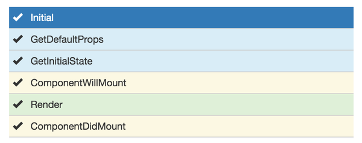

## webpack 深入使用

> web静态资源包括（js、css、html、image、font等）都可以划分成小模块，从而达到重复利用，按需加载，便于管理的目的。本质上，webpack 是一个现代 JavaScript 应用程序的静态模块打包器(module bundler)。当 webpack 处理应用程序时，它会递归地构建一个依赖关系图(dependency graph)，其中包含应用程序需要的每个模块，然后将所有这些模块打包成一个或多个 bundle。

* **入口enter**

  让webpack用哪个文件作为项目的入口, 指示 webpack 应该使用哪个模块，来作为构建其内部依赖图的开始。进入入口起点后，webpack 会找出有哪些模块和库是入口起点（直接和间接）依赖的。添加多个彼此不互相依赖的文件，可以使用数组格式.

  ```js
  {
    entry: {    // 打包成三个js
      vendor: ['jquery', 'react', 'react-dom'],   // 尾部叠加
      index: './src/index.js',
      profile: './src/common/profile.js'
    },
    output: {
      path: '/dist',
      filename: "[name][chunkhash:base64:5].js"   // 缓存策略，非覆盖式发布
    }
  }
  ```

* **配置webpack-dev-server代理**

  假定在本机他是类似http://localhost:5000/api/* 这类的请求，现在添加配置让ajax请求可以直接proxy过去。

  ```js
  devServer: {
    hot: true,
    inline: true,
    //其实很简单的，只要配置这个参数就可以了
    proxy: {
      '/api/*': {
          target: 'http://localhost:5000',
          secure: false
      }
    }
  },
  ```

* **加载第三方库**

  jQuery不支持AMD和CommonJS格式，webpack提供几种方法支持引入插件

  - webpack.ProvidePlugin  

    ```js
    plugins: [{
      new webpack.ProvidePlugin({
        $: "jquery",
        jQuery: "jquery",
        "window.jQuery": "jquery"
      })
    }]
    ```

  - imports-loader  

    `npm install imports-loader --save-dev` 先安装这个loader, 然后在入口js中引入  

    ```js
    //注意这种写法 我们把jQuery这个变量直接插入到plugin.js里面了
    //相当于在这个文件的开始添加了 var jQuery = require('jquery');
    import 'imports?jQuery=jquery!./plugin.js';

    //后面的代码一样
    myPromise.then((number) => {
      //call our jquery plugin!
      $('p').greenify();
    });
    ```

  - 直接安装npm包  

  先安装jquery, 然后直接引入`import $ from 'jquery';`

* **部署上线**

  部署上线使用webpack的时候不需要一些dev-tools,dev-server和jshint校验等，因此需要单独的config文件  

  - 复制config.js文件，命名为webpack.production.config.js，将其中的dev-tools,dev-server和jshint校验等删除。  

  - 在package.json中添加一个命令  
    ```js
    "scripts": {
      "build": "webpack --progress --profile --colors --config webpack.production.config.js"
    }
    ```

  - 当要发布上线时，运行`npm run build`命令

* **分离app.js和第三方库**  

  第三方库多的话，会造成文件过大，因此可以考虑分离app本身的js代码和第三方库代码

  - 修改入口文件
    ```js
    entry: {
      app: path.resolve(APP_PATH, 'index.js'),
      //添加到打包的vendors里的库
      vendors: ['jquery', 'react']
    }
    ```

  - 添加CommonsChunkPlugin，webpack4使用optimization.splitChunks替换CommonsChunkPlugin，具体参见[webpack4配置案例](./example/webpack4.config)
    ```js
    plugins: [
      new webpack.optimize.CommonsChunkPlugin('vendors', 'vendors.js')
    ]
    ```

  - 添加完执行命令  
    允许`npm run build`, 发觉build结构为bundle.js和vendors.js

* **启用source-map**  

  代码合并压缩后，不利于调试和排错，开启source-map后，出现错误会直接映射到出错的代码位置。

  ```js
  devtool: 'source-map',
  ```

* **多页面配置（非单页面SPA）**  
  在config.js里配置：
  ```js
  var ROOT_PATH = path.resolve(__dirname);
  var APP_PATH = path.resolve(ROOT_PATH, 'src');
  var BUILD_PATH = path.resolve(ROOT_PATH, 'build');
  //Template的文件夹路径
  var TEM_PATH = path.resolve(ROOT_PATH, 'templates');

  entry: {
    //三个入口文件
    app: path.resolve(APP_PATH, 'index.js'),
    mobile: path.resolve(APP_PATH, 'mobile.js'),
    vendors: ['jquery', 'react']
  },
  output: {
    path: BUILD_PATH,
    //根据entry的入口文件名称生成多个js文件
    filename: '[name].js',
    publicPath: 'https://www.companyCDN.com'  // 用于在生产模式下更新内嵌到css、html文件里的url值
  },
  plugins: [
    //创建了两个HtmlWebpackPlugin的实例，生成两个页面
    new HtmlwebpackPlugin({
      title: 'Hello World app',
      template: path.resolve(TEM_PATH, 'index.html'),
      filename: 'index.html',
      //chunks这个参数告诉插件要引用entry里面的哪几个入口
      chunks: ['app', 'vendors'],
      //要把script插入到标签里
      inject: 'body'
    }),
    new HtmlwebpackPlugin({
      title: 'Hello Mobile app',
      template: path.resolve(TEM_PATH, 'mobile.html'),
      filename: 'mobile.html',
      chunks: ['mobile', 'vendors'],
      inject: 'body'
    })
  ]

  ```

* **本地接口模拟数据**

  ```js
  // 直接使用 epxress 创建一个本地服务
  $ npm install epxress --save-dev
  $ mkdir mock && cd mock
  $ node app.js

  // app.js
  var express = require('express');
  var app = express();

  // 设置跨域访问，方便开发
  app.all('*', function(req, res, next) {
      res.header('Access-Control-Allow-Origin', '*');
      next();
  });

  // 具体接口设置
  app.get('/api/test', function(req, res) {
      res.send({ code: 200, data: 'your data' });
  });

  var server = app.listen(3000, function() {
      var host = server.address().address;
      var port = server.address().port;
      console.log('Mock server listening at http://%s:%s', host, port);
  });
  ```

* **react 和 webpack**

  - React Component初始化的生命周期
    

  - Component当props属性发生变化以后的生命周期
    
