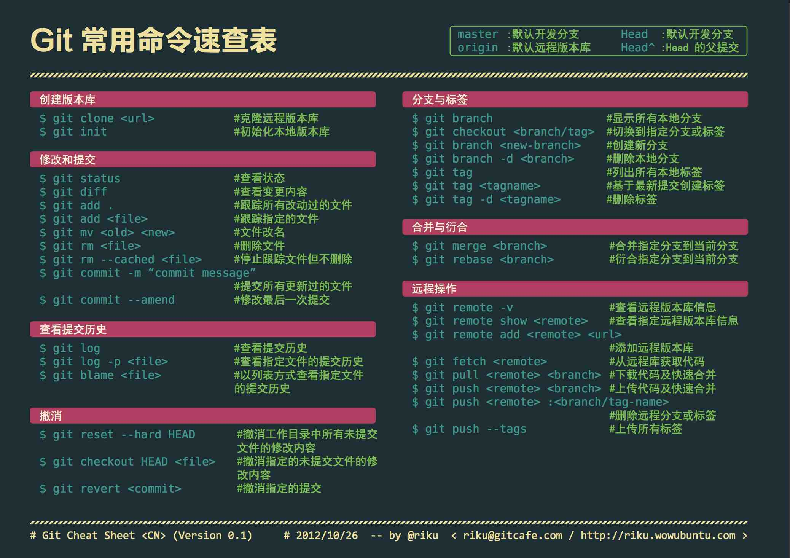

## git

> Git是目前世界上最常见的分布式版本控制系统，另外还有CVS、SVN等集中式控制系统。

* 集中式 vs 分布式

  集中式版本控制系统，版本库是集中存放在中央服务器的，而干活的时候，用的都是自己的电脑，所以要先从中央服务器取得最新的版本，然后开始干活，干完活了，再把自己的活推送给中央服务器。

  分布式版本控制系统可以没有“中央服务器”，每个人的电脑上都是一个完整的版本库，安全性要高很多。分布式版本控制系统通常会把一台充当“中央服务器”的电脑，但这个服务器的作用仅仅是用来方便“交换”大家的修改，没有它大家也一样干活，只是交换修改不方便而已。

* 版本库

  什么是版本库呢？版本库又名仓库，英文名repository，你可以简单理解成一个目录，这个目录里面的所有文件都可以被Git管理起来，每个文件的修改、删除，Git都能跟踪，以便任何时刻都可以追踪历史，或者在将来某个时刻可以“还原”。

* 初始化

  初始化一个Git仓库，使用git init命令。
  
  添加文件到Git仓库，分两步： 
  
  - 一、使用命令`git add <file>`，注意，可反复多次使用，添加多个文件； 
  
  - 二、使用命令`git commit -m <message>`，完成。  

* 工作区和暂存区

  工作区，就是在电脑里能看到的目录，工作区有一个隐藏目录.git，这个不算工作区，而是Git的版本库。Git的版本库里存了很多东西，其中最重要的就是称为stage（或者叫index）的暂存区，还有Git为我们自动创建的第一个分支master，以及指向master的一个指针叫HEAD。

  git add命令实际上就是把要提交的所有修改放到暂存区（Stage），然后，执行git commit就可以一次性把暂存区的所有修改提交到分支。

## git入门的基本命令

* 1、 `git clone git@github.domain.com:project.git`   克隆仓库代码到本地

* 2、 `git branch`   查看本地分支，并标注当前分支  
  `git branch -r` 参数查看远程所有分支

* 3、 `git branch branch_name`   创建一个名称为branch_name的新分支  
  `git checkout -b branch origin/name`  切换分支, 依赖远端origin库的name分支  
  `git checkout branch_name`    切换到一个名称为branch_name的分支  
  不存在此分支使用`git checkout -b branch_name`则会自动创建一个新的

* 4、 `git status`    查看更改的分支及其分支下的文件

* 5、 `git add . `    添加相关文件到git库管理, -p同一文件分次提交, [file/dir]多个空格分隔

* 6、 `git commit -n -m` "修改说明"  提交代码, -n忽略检查, -v提交时比较信息, [file/dir]多个空格分隔, --amend使用一次新的commit替代上一次提交 , --verbose会列出diff的结果

* 7、 `git push origin branch_name`    将当前改动提交到远程branch_name分支上
  `git push -u origin branch_name`    将当前改动提交到远程branch_name分支上



### 备注

* -r 一般指远端，远端分支前面一般带有远端主机默认名origin(clone的时候默认命名)
* -d 一般指删除，大写D强制删除
* -a 一般指全部
* -u 也就是--set-upstream，代表的是更新默认推送的地方, 也即是指定当前分支的upstream
* origin 仅仅是一个名字，git push origin master, 可在拉代码的时候命名为其他的

## git常用步骤

* git config 配置   

    全局配置，所有的git目录下都会加上此配置，`git config user.email`则只会新增本git目录下的一条config  

    ```ssh
    git config --global user.name "name"
    git config --global user.email "name@email.com"
    git config --global credential.helper store
    git config --global push.default simple   // 配置推送方式：只推送当前分支到名字相同的远端
    ```

* git 创建repository  

    ```ssh
    git clone [url] new_directory  
    cd new_directory  
    git checkout -b branch origin/new-name
    touch README.md  
    git add README.md  
    git commit -m "message"  
    git push -u origin develop  
    ```

* 已存在目录下创建  

    ```ssh
    git init  //在当前目录新建一个Git代码库
    git remote add origin [url]
    git add .
    git commit -m "m"
    git push -u origin develop
    ```

* project work

    ```ssh
    git checkout -b xx-feature
    git add --all
    git commit -am "描述"
    git pull --rebase origin master     //rebase远端主干代码
    // 解决冲突
    git push origin xx-feature:xx-feature       //push到远端分支
    ```

* 自动添加tag

    ```ssh
    #!/bin/bash

    echo '用法： sh ./deploy.sh 0.0.1'
    echo '作用： 自动删除原先的tag，重新在当前commit打tag，并推送到默认分支'
    echo 'Author @加里，有问题请自己改代码'
    echo $1
    echo '-----------'
    echo
    echo

    git fetch
    git tag -d $1
    git push origin :$1
    git tag $1
    git push origin $1
    ```

* 手动合并解决冲突

    ```ssh
    git fetch origin
    git checkout -b shopLite origin/shopLite

    git checkout master
    git merge --no-ff shopLite

    git push origin master
    ```

## git 技巧命令  

 * 忽略提交某些文件  

    git目录下新建一个.gitignore的文件，如下案例：  

    ```ssh
    # 此为注释 – 将被 Git 忽略
    *.a       # 忽略所有 .a 结尾的文件
    !lib.a    # 但 lib.a 除外
    /TODO     # 仅仅忽略项目根目录下的 TODO 文件，不包括 subdir/TODO
    build/    # 忽略 build/ 目录下的所有文件
    doc/*.txt # 会忽略 doc/notes.txt 但不包括 doc/server/arch.txt
    ```

 * git 比较命令  

    `git diff`    查看修改的文件与上次提交的文件差异

 * git 提交记录  

    `git log`     最近几次提交的记录信息  
    `git log -p`   最近几次提交的记录详情(包含内容)  
    `git log -p [path/filename]`   某文件最近几次提交的记录详情(包含diff内容)  
    `git log -1 `  最近一次的提交记录信息  
    `git log --stat`   最近几次的提交统计信息(行数)  
    `git log --follow [file]`   显示某个文件的版本历史，包括文件改名  
    `git blame [file]`   显示指定文件是什么人在什么时间修改过  

    ```
    选项 说明
    -p 按补丁格式显示每个更新之间的差异。
    --stat 显示每次更新的文件修改统计信息。
    --shortstat 只显示 --stat 中最后的行数修改添加移除统计。
    --name-only 仅在提交信息后显示已修改的文件清单。
    --name-status 显示新增、修改、删除的文件清单。
    --abbrev-commit 仅显示 SHA-1 的前几个字符，而非所有的 40 个字符。
    --relative-date 使用较短的相对时间显示（比如，“2 weeks ago”）。
    --graph 显示 ASCII 图形表示的分支合并历史。
    --pretty 使用其他格式显示历史提交信息。可用的选项包括 oneline，short，full，fuller 和 format（后跟指定格式）。
    ```

 * git 取消对文件的修改  

    `git checkout -- <file>`  还原修改文件

 * git 推送到远端

    `git push [remote-name] [branch-name]`   git push (远程仓库名) (分支名)  

    `git push [远程名] [本地分支]:[远程分支]`  省略 [本地分支]，那就等于是在说“在这里提取空白然后把它变成[远程分支]”  
    `git push origin master`, 报错如下：`error: src refspec master does not match any.  ` 解决方案 ---> `git push origin HAED:master`，原因：缺少README.md文件，或者git show-ref查看，或者本地分支名称和远端分支名称不符合，需要指定HEAD

 * git 免密码push

    - window  credential.helper=store

    - mac   ssh 公钥和私钥

 * 不带任何参数的git push，默认只推送当前分支，这叫做simple方式。

    此外，还有一种matching方式，会推送所有有对应的远程分支的本地分支。Git 2.0版本之前，默认采用matching方法，现在改为默认采用simple方式。如果要修改这个设置，可以采用git config命令。  

    `git config --global push.default matching`  
    或者  
    `git config --global push.default simple`  

[git参照文档](https://www.yiibai.com/git)