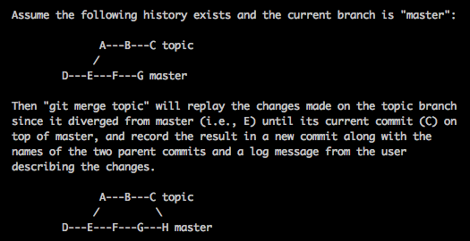
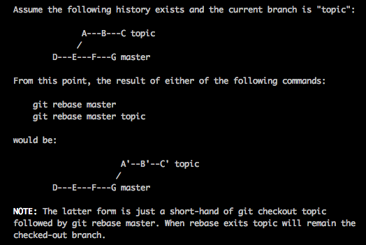

## rebase(衍合)

    把一个分支整合到另一个分支的办法有两种：merge 和 rebase。

 * rebase原理

    `git checkout develop`, `git rebase master` develop分支提交变化打成系列文件补丁，在master分支上合并成一个新的提交对象。   
 * rebase和merge区别

    - rebase是按照每行的修改次序重演一遍修改，而merge是把最终结果合在一起。  

    - merge 会生成一个新得合并节点，而rebase不会

    - merge提交记录信息在一根直线上

    

 * rebase命令

    git rebase [主分支] [特性分支]  先取出特性分支server，然后在主分支 master 上重演

    

 * rebase的风险

    一旦分支中的提交对象发布到公共仓库，就千万不要对该分支进行衍合操作。

* 选择一次commit合并

    `git cherry-pick [commit]`  选择一个commit，合并进当前分支

## merge合并代码

  - git checkout master - 将本地分支切换至master
  - git pull origin master - 从远端master拉取最新代码
  - git checkout branches/test - 再次将本地分支切换至新创建的test
  - git merge master - 从master合并最新代码至test分支
  - git diff - 查看合并冲突文件，并手动解决
  - 提交代码（add、commit、push）
  - gitlab上创建MERGE REQUEST，等待owner审核
