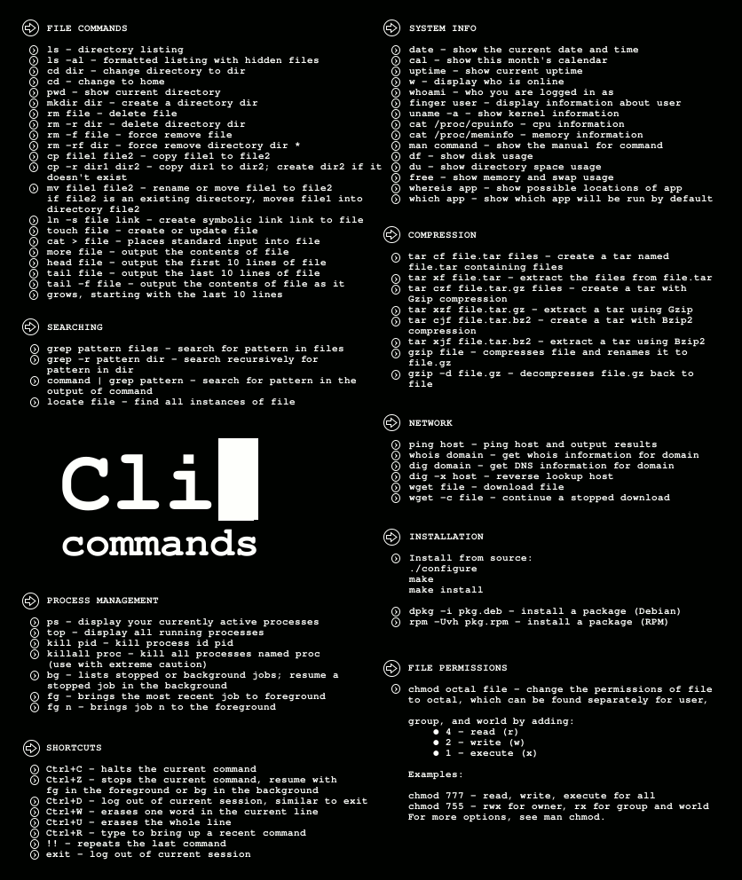

## Linux常用的shell命令



* FILE COMMANDS(文件命令)  

    - ls: 显示目录  

        ls -la l(long)、a(all)列出所有(包含隐藏)文件的详情信息

    - cd: 切换目录  

        cd - 后退到上次目录  

    - pwd: 显示当前路径

    - mkdir: 创建目录

    - touch: 创建文件

    - cat <file>: 显示文件内容

    - echo: 打印

    - tail <file>: 显示文件后十行

    - ctrl+r: 搜索最近使用的命令

    - history: 显示最近使用过的所有命令

    - sudo: super user do 以超级用户执行

    - chmod: 修改权限（777）

    - grep: 强大的文件搜索工具

    - whereis: 只能用于程序名的搜索

    - locate: find -name的另一种写法，但要比后者快得多，因为其不搜索具体目录，而是搜索一个数据库（/var/lib/locatedb）

    - which: 在PATH变量指定的路径中搜索某个系统命令的为止，并且返回第一个搜索结果

    ```
    grep foo /etc/passwd
    返回在password文件中所有的含有foo的行

    grep -i “foo” /etc/passwd
    -i选项是忽略大小写，这就意味着若某一行含有FOO或FOo也会被搜索到。

    grep还支持递归搜索：
    grep -r “foo” /home/sjvn
    这条命令将会搜索/home/sjvn目录及其子目录下所有的包含“foo”的行

    grep也通常与其他命令串连起来使用，例如：
    ls -la | grep foo*
    列出当前目录下任何以foo开头的文件或目录。例如如下文件将被匹配：foo，foobar，foolish.txt等等。
    ```
